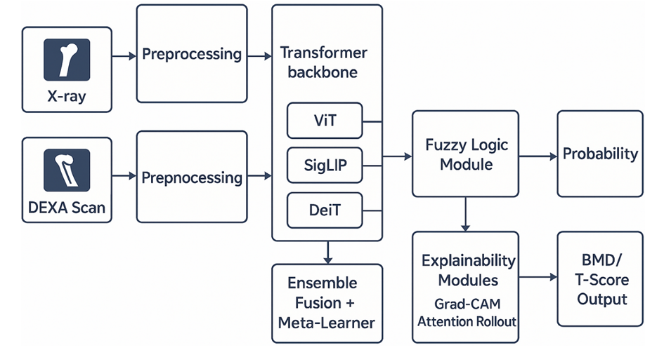
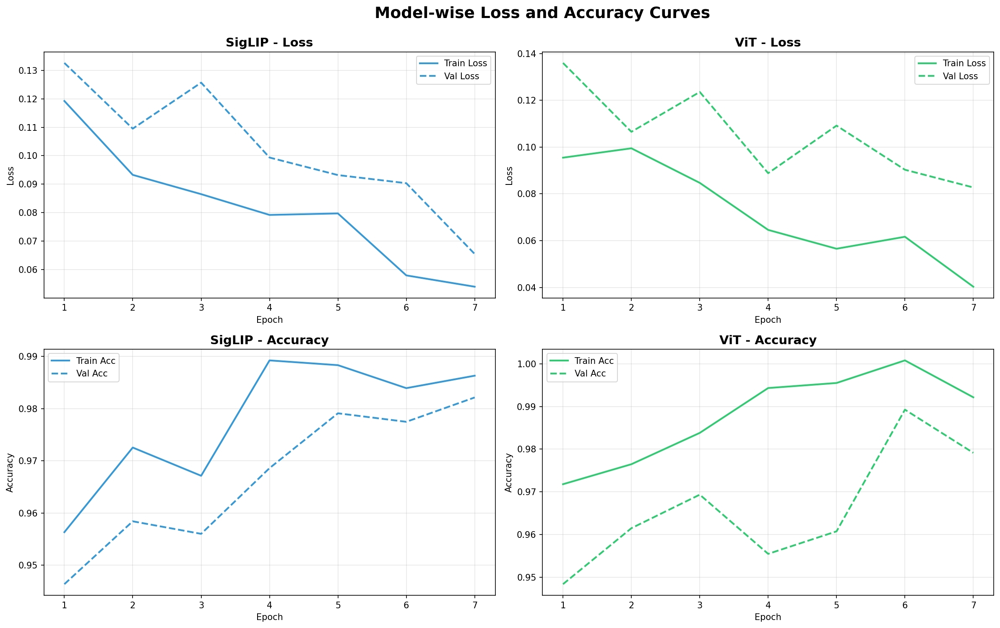
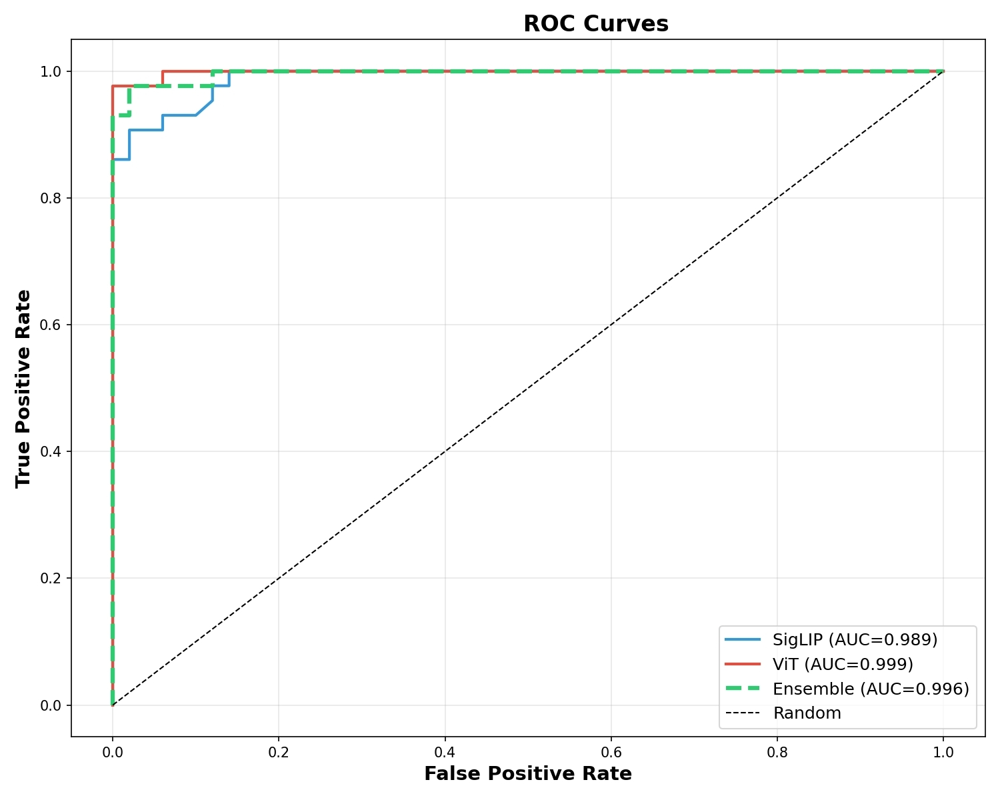
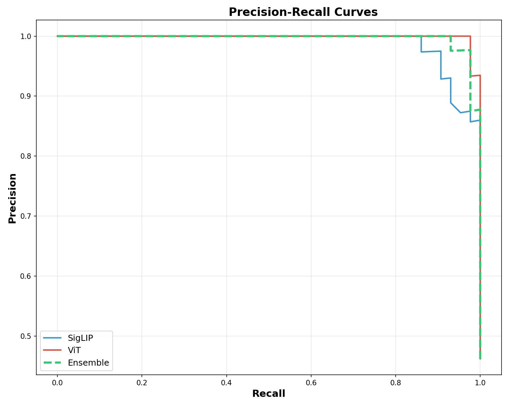
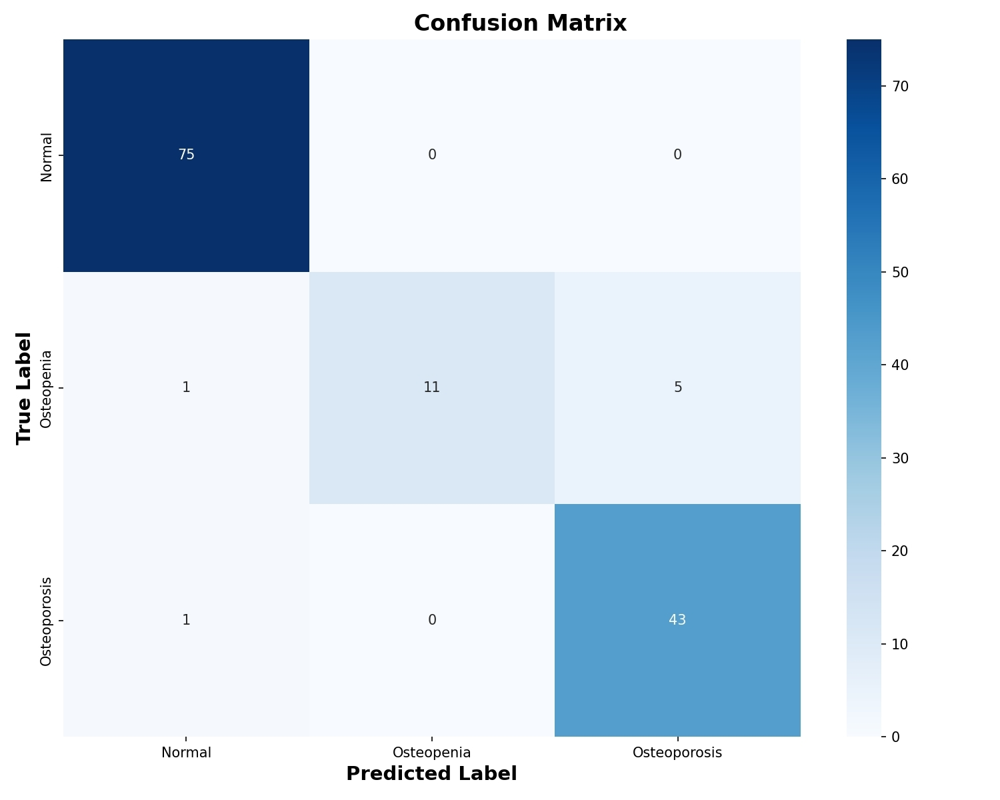
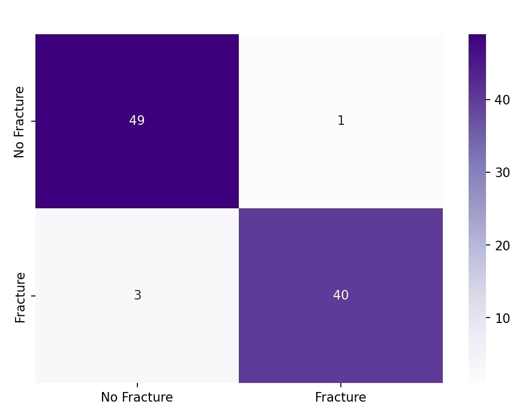
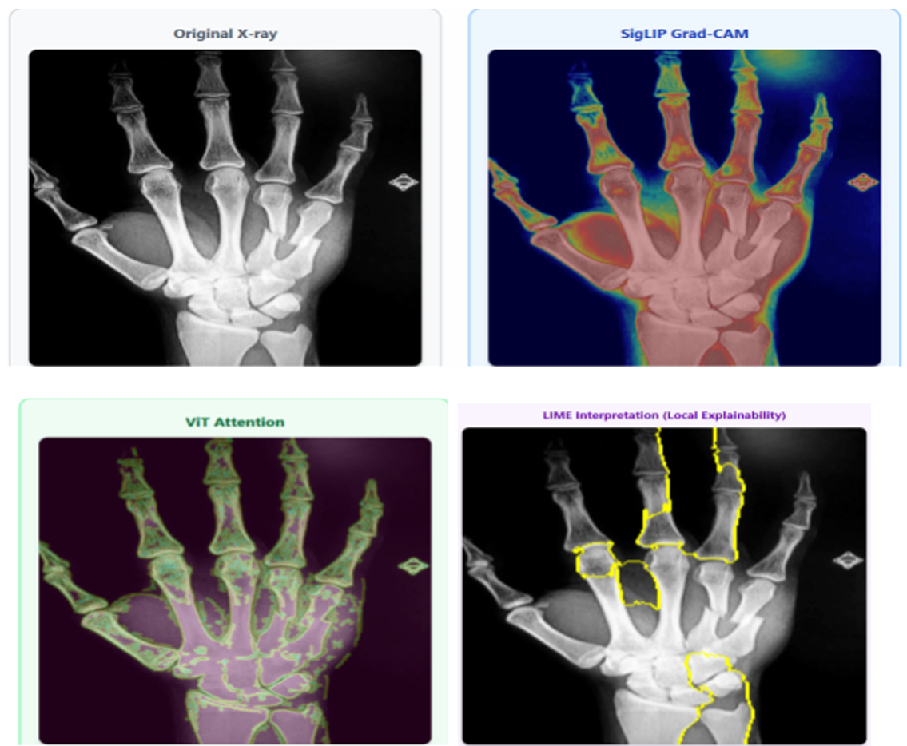
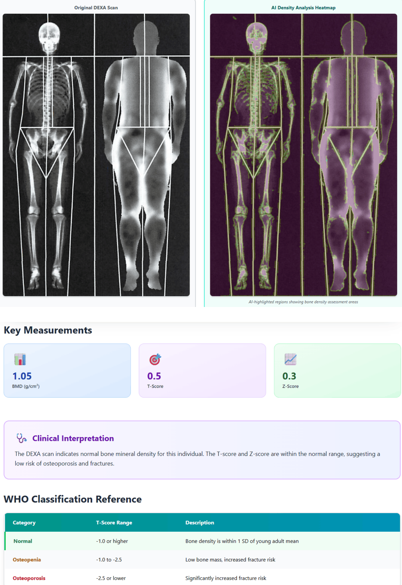

# Bone Health Assessment with Fuzzy Logic-Based Fracture Risk Evaluation

An intelligent AI-powered framework for automated bone fracture detection and bone health assessment using Vision Transformers, Ensemble Learning, Explainable AI, and Fuzzy Logic.

---

# Project Overview

Bone fractures and osteoporosis are among the most common musculoskeletal disorders worldwide. Accurate diagnosis from radiographs requires experienced clinicians and can often be affected by subtle fracture patterns, image quality, and human variability.

This project proposes a **Hybrid Multi-ViT Framework** that combines multiple Vision Transformer architectures with **Fuzzy Logic-based Risk Evaluation** to automatically detect fractures, assess bone health, and provide clinically interpretable risk levels.

Unlike traditional deep learning models that only output fracture predictions, the proposed framework integrates explainable AI and fuzzy inference to improve transparency and clinical usability.

---

# Features

- Bone Fracture Detection
- Bone Health Assessment
- Vision Transformer (ViT)
- SigLIP Feature Extraction
- DeiT Integration
- Ensemble Learning
- Fuzzy Logic-Based Risk Assessment
- Explainable AI (Grad-CAM)
- Multi-modal Analysis
- Clinical Risk Categorization

---

# System Architecture

The proposed framework consists of multiple stages:

1. Image Preprocessing
2. Vision Transformer Feature Extraction
3. SigLIP Feature Extraction
4. DeiT Integration
5. Ensemble Prediction
6. Fuzzy Logic Risk Evaluation
7. Explainability using Grad-CAM
8. Final Diagnostic Report

---

# Dataset

The framework was developed using publicly available medical imaging datasets including:

- FracAtlas
- MURA Dataset
- Bone Fracture Dataset
- Knee X-ray Osteoporosis Dataset
- RSNA Cervical Spine Fracture Dataset
- Human Bone Fracture Multi-modal Dataset
- DEXA Scan Dataset

Dataset Distribution

| Split | Images |
|--------|--------:|
| Training | 1200 |
| Validation | 300 |
| Testing | 93 |

---

# Deep Learning Models

| Model | Purpose |
|--------|---------|
| Vision Transformer (ViT) | Global Feature Learning |
| SigLIP | Fine-grained Feature Extraction |
| DeiT | Data-efficient Learning |
| Ensemble Learning | Prediction Fusion |
| Fuzzy Logic | Clinical Risk Evaluation |
| Grad-CAM | Explainable AI |

---

# Technologies Used

- Python
- PyTorch
- Hugging Face Transformers
- Vision Transformer (ViT)
- SigLIP
- DeiT
- Grad-CAM
- Fuzzy Logic
- Scikit-learn
- NumPy
- Pandas
- Matplotlib
- OpenCV

---

# Training Configuration

| Parameter | Value |
|------------|--------|
| Image Size | 224 × 224 |
| Optimizer | AdamW |
| Batch Size | 16 |
| Epochs | 8 |
| Learning Rate | 1e-4 |
| Loss Function | Cross Entropy |
| Device | CUDA GPU |

---

# Results

The proposed hybrid framework achieved strong fracture detection performance while providing clinically interpretable outputs.

---

## Training Performance

The model demonstrates stable convergence with increasing validation accuracy and decreasing validation loss during training.

---

## ROC Curve

The ensemble model achieved excellent class discrimination, indicating strong diagnostic capability.

---

## Precision–Recall Curve

High precision and recall values demonstrate the robustness of the proposed model for fracture detection.

---

## Bone Disease Detection Confusion Matrix

---

## Fracture Detection Confusion Matrix

Both confusion matrices indicate reliable classification performance for bone disease detection and fracture identification.

---

# Explainable AI

To improve clinical trust, the framework integrates **Grad-CAM** visualization, highlighting the image regions responsible for the model's predictions.

The visualization helps clinicians understand how the model reaches its diagnostic decision.

---

# Clinical Report Generation

The framework produces an interpretable diagnostic report by combining deep learning predictions with fuzzy logic-based reasoning.

The report includes:

- Fracture Probability
- Bone Measurements
- Risk Category
- Clinical Interpretation
- Explainability Visualization

---

# Fuzzy Logic Risk Assessment

Instead of providing only a binary prediction, the system estimates five clinically meaningful risk levels.

| Risk Level | Interpretation |
|-------------|----------------|
| Very Low | Fracture extremely unlikely |
| Low | Mild signs |
| Medium | Uncertain |
| High | Strong indicators |
| Very High | Clear fracture characteristics |

---

# Future Improvements

- Real-time clinical deployment
- Mobile application
- PACS integration
- Multi-class fracture localization
- Federated learning
- Hospital decision support systems

---

# Authors
- **Ishita Rana:**
  www.linkedin.com/in/ishita-rana-03651b305
- **Leena:**
  www.linkedin.com/in/leenabansal1108

---

## If you found this project useful, consider giving this repository a Star!
